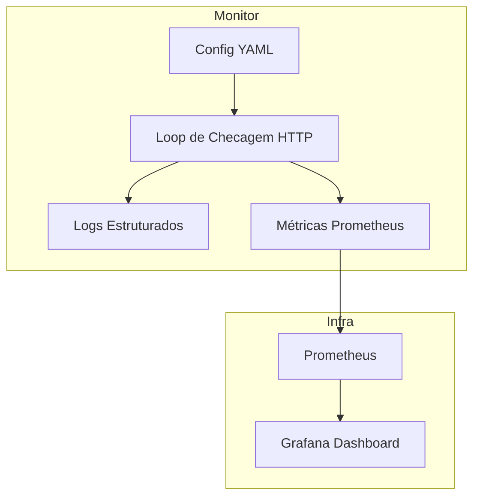

# 🚀 Go-Sre-Monitor

**Monitor HTTP minimalista em Go** com **métricas Prometheus**, **healthcheck**, **logs estruturados** e **configuração via YAML**.  
Projetado para uso em **labs DevOps/SRE**, POCs de observabilidade, monitoramento de disponibilidade e controle de SLOs.

---

## 📌 Sumário
- [Visão Geral](#visão-geral)
- [Arquitetura](#arquitetura)
- [Fluxo de Funcionamento](#fluxo-de-funcionamento)
- [Instalação e Build](#instalação-e-build)
- [Configuração](#configuração)
- [Execução](#execução)
- [Métricas Exportadas](#métricas-exportadas)
- [Integração com Prometheus & Grafana](#integração-com-prometheus--grafana)
- [Variáveis de Ambiente](#variáveis-de-ambiente)
- [Boas Práticas](#boas-práticas)
- [Troubleshooting](#troubleshooting)
- [Licença](#licença)

---

## 🎯 Visão Geral
O **go-sre-monitor** executa checagens periódicas de endpoints HTTP/HTTPS e exporta métricas de disponibilidade e performance para consumo via Prometheus.  
Ele é leve, containerizável e totalmente configurável via **YAML**, suportando:
- **Métodos GET/HEAD**
- **Timeouts e SLOs por serviço**
- **Customização de cabeçalhos HTTP**
- **Logs estruturados em JSON**
- **Integração com Prometheus + Grafana**

---

## 🏗 Arquitetura


---

### 🔄 Fluxo de Funcionamento

- Carregamento da Configuração → lê configs/services.yaml e prepara a lista de endpoints.
- Execução das Probes → realiza requisições HTTP em paralelo, respeitando timeouts e métodos definidos.
- Validação de Status & SLOs → compara códigos de resposta com o esperado e mede latência.
- Exportação de Métricas → expõe métricas no endpoint /metrics.
- Integração com Prometheus → coleta e armazena métricas.
- Visualização no Grafana → dashboards prontos para análise.
##
### 🛠 Instalação e Build
Clonar repositório
```bash
git clone https://github.com/viniciushammett/go-sre-monitor.git
cd go-sre-monitor
```
Baixar dependências
```bash
make tidy
```
Build local
```bash
make build
./bin/go-sre-monitor
```
##
### ⚙ Configuração
Arquivo padrão: `configs/services.yaml`
```yaml
services:
  - name: homepage
    url: "https://example.org/"
    method: "GET"
    expectedStatus: 200
    timeout: 3s
    sloLatency: 500ms

  - name: httpbin
    url: "https://httpbin.org/status/200"
    method: "GET"
    expectedStatus: 200
    timeout: 2s
    sloLatency: 300ms
    headers:
      X-Source: "go-sre-monitor"
```
Campos suportados:

| Campo            | Descrição                                        | Default |
| ---------------- | ------------------------------------------------ | ------- |
| `name`           | Nome único do serviço                            | —       |
| `url`            | Endpoint HTTP/HTTPS                              | —       |
| `method`         | Método HTTP (GET/HEAD)                           | `GET`   |
| `expectedStatus` | Código de status esperado                        | `200`   |
| `timeout`        | Tempo máximo por requisição                      | `3s`    |
| `sloLatency`     | Latência máxima aceitável antes de contar breach | —       |
| `headers`        | Cabeçalhos HTTP extras                           | —       |

##
### ▶ Execução
Local
```bash
CONFIG_PATH=configs/services.yaml \
HTTP_ADDR=:8080 \
LOG_LEVEL=info \
PROBE_INTERVAL=15s \
go run ./cmd/monitor
```
Docker
```bash
docker build -t go-sre-monitor:local .
docker run -p 8080:8080 go-sre-monitor:local
```
Docker Compose (com Prometheus + Grafana)
```bash
make docker
make compose-up
```
- Prometheus → http://localhost:9090
- Grafana → http://localhost:3000 (admin/admin)
##
### 📊 Métricas Exportadas
| Métrica                      | Tipo      | Descrição                       |
| ---------------------------- | --------- | ------------------------------- |
| `probe_up`                   | Gauge     | 1 se serviço está UP, 0 se DOWN |
| `probe_duration_seconds`     | Histogram | Latência por serviço            |
| `probe_failures_total`       | Counter   | Total de falhas                 |
| `slo_latency_breaches_total` | Counter   | Total de violações de SLO       |
##
### 📈 Integração com Prometheus & Grafana
Config Prometheus `(configs/prometheus.yml)`
```yaml
scrape_configs:
  - job_name: "go-sre-monitor"
    static_configs:
      - targets: ["monitor:8080"]
```
Dashboard Grafana
Arquivo pronto em `dashboards/grafana-dashboard.json`

- Inclui:
  - Status geral dos serviços
  - Latência p95
  - Falhas nos últimos 5m
  - Violações de SLO

##
### 🌍 Variáveis de Ambiente
| Variável         | Default                 | Descrição                                       |
| ---------------- | ----------------------- | ----------------------------------------------- |
| `CONFIG_PATH`    | `configs/services.yaml` | Caminho do YAML                                 |
| `HTTP_ADDR`      | `:8080`                 | Host/porta HTTP                                 |
| `LOG_LEVEL`      | `info`                  | Nível de log (`debug`, `info`, `warn`, `error`) |
| `PROBE_INTERVAL` | `15s`                   | Intervalo entre probes                          |

##
### 📌 Boas Práticas
- Use timeouts curtos para não travar o loop de probes.
- Monitore o histograma de latência no Grafana para ajustar SLOs.
- Separe serviços críticos e não-críticos em jobs Prometheus distintos.
- Evite hardcode de URLs no código — use sempre o YAML.
##
### 🐞 Troubleshooting
- Métricas não aparecem no Prometheus: verifique se o job está configurado no `prometheus.yml` e se o container `monitor` está acessível.
- Timeouts frequentes: aumente o campo `timeout` no YAML ou revise a rede.
- Falhas 4xx/5xx constantes: valide `expectedStatus` e se o endpoint está correto.
- Logs não aparecem: ajuste `LOG_LEVEL` para `debug`.
##
### 📜 Licença
MIT License – veja o arquivo LICENSE para detalhes.
