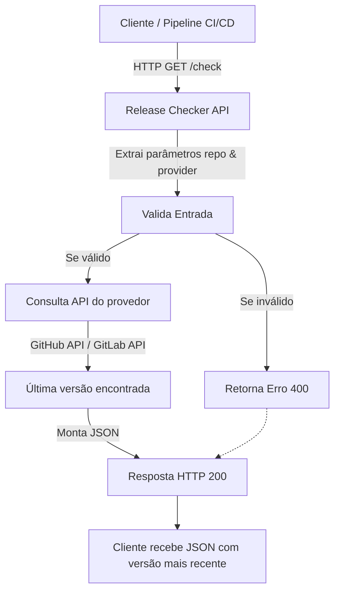

<div align="center">
  <h1>🚀 Release Checker API</h1>
  <p>API em Go para verificar automaticamente a versão mais recente de projetos em repositórios públicos (GitHub, GitLab, etc.) e expor os resultados via HTTP.</p>
</div>

---

## 📖 Descrição

O **Release Checker API** é um serviço HTTP simples que permite consultar, via API REST, a versão mais recente de um projeto hospedado em plataformas como **GitHub** e **GitLab**.

Ele é ideal para:
- Pipelines de CI/CD que precisam validar versões antes de realizar builds.
- Monitoração de releases de ferramentas utilizadas na sua infraestrutura.
- Automação de atualizações internas.

---

## ⚙️ Como funciona

1. Recebe uma requisição HTTP com o repositório desejado.
2. Consulta a API oficial do provedor (ex.: `api.github.com/repos/{owner}/{repo}/releases/latest`).
3. Retorna a versão mais recente em **JSON**.

---

## 📌 Exemplo de Requisição

```bash
curl "http://localhost:8080/check?repo=owner/repo&provider=github"


### Resposta:

```json
{
  "repo": "owner/repo",
  "provider": "github",
  "latest_version": "v2.1.4",
  "published_at": "2025-08-09T10:32:00Z",
  "url": "https://github.com/owner/repo/releases/tag/v2.1.4"
}
```

---

## 🛠 Uso Local

### 1️⃣ Clonar o projeto

```bash
git clone https://github.com/viniciushammett/Golang-DevOps-SRE-Aplicado.git
cd Golang-DevOps-SRE-Aplicado/release-checker-api
```

### 2️⃣ Criar o módulo Go (se necessário)

Se você estiver rodando fora do `go.work`, inicialize o módulo:

```bash
go mod init github.com/seu-usuario/release-checker-api
go mod tidy
```

### 3️⃣ Rodar localmente

```bash
go run main.go
```

Servidor iniciará em:

```
http://localhost:8080
```

---

## 🐳 Rodar com Docker

### Build:

```bash
docker build -t release-checker-api .
```

### Run:

```bash
docker run -p 8080:8080 release-checker-api
```

---

## ☸️ Exemplo de Deploy no Kubernetes

```yaml
apiVersion: apps/v1
kind: Deployment
metadata:
  name: release-checker-api
spec:
  replicas: 1
  selector:
    matchLabels:
      app: release-checker-api
  template:
    metadata:
      labels:
        app: release-checker-api
    spec:
      containers:
        - name: api
          image: release-checker-api:latest
          ports:
            - containerPort: 8080
---
apiVersion: v1
kind: Service
metadata:
  name: release-checker-api
spec:
  selector:
    app: release-checker-api
  ports:
    - port: 8080
      targetPort: 8080
```

---

## 📈 Workflow CI/CD (GitHub Actions)

```yaml
name: Release Checker API CI

on:
  push:
    branches: ["main"]
  pull_request:
    branches: ["main"]

jobs:
  build:
    runs-on: ubuntu-latest
    steps:
      - uses: actions/checkout@v3
      - name: Set up Go
        uses: actions/setup-go@v4
        with:
          go-version: '1.22'
      - name: Install dependencies
        run: go mod tidy
      - name: Run tests
        run: go test ./...
      - name: Build
        run: go build -o release-checker-api .
```

---

## 🧪 Testando a API

```bash
curl "http://localhost:8080/check?repo=hashicorp/terraform&provider=github"
```

---

## 🗺 Roadmap

* Suporte para Bitbucket.
* Cache local para reduzir chamadas à API.
* Autenticação por token para APIs privadas.
* Integração com Prometheus para métricas de releases.
* CLI para uso rápido no terminal.

## 📊 Arquitetura / Fluxo de Funcionamento


